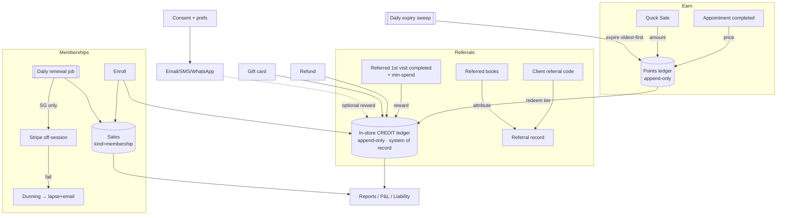

# MODULE_RELATIONSHIP_MAP

How Flowesce's retention modules connect. The **in-store credit ledger** is the hub —
loyalty, referrals, gift cards, memberships and refunds all read/write it.

## Relationship table
| # | Source | → Dest | Trigger | Data moved | Business rule | Sync? | 1/2-way | Manual? |
|---|---|---|---|---|---|---|---|---|
| 1 | Appointment `complete` | Points ledger | Appt marked complete | headline service price | earn = price × rate (points) or +1 stamp | sync | 1-way | none |
| 2 | Quick Sale | Points ledger | Walk-in/retail sale closes | sale amount | same earn rules | sync | 1-way | none |
| 3 | Points ledger | Credit ledger | Client redeems a tier | points burned → credit minted | 800 pts → $20 credit ("loyalty reward") | sync | 1-way | manual redeem tap |
| 4 | Expiry job | Points ledger | Daily scheduled sweep | expired point batches | mode: none / inactivity-reset / fixed-from-earn (oldest-first) | async | 1-way | none |
| 5 | Referral code | Referral record | Referred books w/ code | attribution → referrer | attribute at booking; hold reward | sync | 1-way | none |
| 6 | Referred first visit `complete` | Credit ledger | First qualifying visit completes | reward credit → referrer | only if min-spend cleared; issued once | sync | 1-way | none |
| 7 | Membership enroll | Sales + Credit + Membership | Owner enrolls client | plan, first credits, first charge | one txn: create plan, drop credits, book `sale(membership)` | sync | 1-way | manual enroll |
| 8 | Membership renewal job | Sales (+ Stripe in SG) | Daily at period boundary | refreshed credits, charge | skip paused; honor cancel-at-period-end; never double-charge | async | 1-way | manual collect (non-SG) |
| 9 | Failed auto-charge (SG) | Dunning → Membership state | Stripe charge fails | retry schedule | retry across grace → lapse + email owner+client | async | 2-way | none |
| 10 | Refund | Credit ledger | Refund to credit | +credit to client | three-axis refund; credit is a tender | sync | 1-way | manual |
| 11 | Gift card | Credit ledger | Gift card load/redeem | credit | same ledger as loyalty/referrals | sync | 2-way | manual |
| 12 | Credit ledger | Reports / P&L | Any ledger/sale write | amounts by kind | membership income = revenue; credit = liability | async | 1-way | none |
| 13 | Consent (Data & privacy) | Comms eligibility | Send attempt | consent + prefs | no send without consent (PDPA) | sync | 1-way | none |
| 14 | Birthday / smart campaign | Comms → Credit (optional) | Scheduled/segment trigger | message; optional reward | win-back / review / anniversary | async | 1-way | none |

## Mermaid — retention system flow

## Avocado design implications
- **Two append-only ledgers, not one.** Points balance and credit balance are distinct: points **earn/expire**, then **redeem into** credit. Flowesce keeps loyalty *points* separate from *in-store credit*; credit is the money-on-account spine. Our schema currently has `credit_ledger` only — **add a `points_ledger`** (with expiry-batch tracking).
- **Completion is the universal earn/qualify event** — model a single `transaction/visit completed` event that loyalty, referrals, and memberships all subscribe to (shared service, not duplicated logic).
- **Idempotency at earn and reward issuance** — one completion = one earn; one referral first-visit = one reward.
- **Scheduled jobs are first-class:** daily points-expiry sweep, daily membership renewal, dunning retries. Build a jobs runner early.
