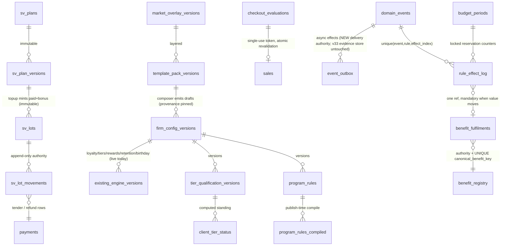

# Frenly Program Studio — architecture (revision 4)

Status: **REVISED PROPOSAL — awaiting independent review round-3 verdict + owner
approval. No implementation until the review returns PASS.**
Author: Fable 5. Date: 2026-07-23. History: rev 2 closed the 14 owner-review
defects → review round 1 **FAIL** (B1–B3 blocking, S1–S7, N1–N3). Rev 3 closed
those → review round 2 **FAIL (narrowed)**: all 14 items PASS, but two new
blockers introduced by the rev-3 fixes (B4 outbox retrofit impossible against the
live v33 schema; B5 shadow-mode registry-write self-contradiction) plus S2-R,
S8-R, N4, N5. Rev 4 closes all round-2 findings; changes logged in §1a/§1b.
Verdict file: `PROGRAM_STUDIO_REVIEW_VERDICT.md`.

Kept from revision 1, per the owner's direction: one versioned configuration spine
(`firm_config_versions`); typed value ledgers; one declared event contract; one
projection layer; adapter views instead of a big-bang rewrite; draft-only
recommendations; industry packs and market overlays rather than firm-specific code.
CHAGEE screenshots remain experience reference only — no branding or copy reproduced.

---

## 1. Decision log (defect → decision → rationale)

| # | Defect in rev 1 | Decision in rev 2 | Rationale |
|---|---|---|---|
| 1 | Bonus-first spend + refundable paid remainder = refund arbitrage (pay $100, get $12 bonus, spend the bonus, refund the untouched $100) | **Proportional spend allocation** across paid/bonus + refund = paid-remaining only + automatic bonus clawback; original lots immutable; append-only `sv_lot_movements` is the authority; `remaining` demoted to a locked cache | Kills the arbitrage arithmetically (§5 matrix); movements give complete audit history; proportional is explainable to customers |
| 2 | "Exactly two value ledgers" was false (gift cards, packages, memberships, entitlements also hold value) | Reframed as **one customer-value domain: typed, non-overlapping ledgers + unified projection**, with a per-type authority table and one-way conversion events | Provable single-representation invariant (§4) instead of a slogan |
| 3 | No event envelope; sync/async undistinguished; comms could conceptually couple to checkout | Immutable `domain_events` envelope + `event_outbox`; hard split of synchronous atomic effects vs asynchronous outbox effects; uniqueness on (event_id, rule_id, effect_index) | Replayability, exactly-once effect execution, checkout can never be rolled back by a notification failure (§6) |
| 4 | Adapters were projection-only with no execution-authority model → double-grant risk during migration | **Benefit registry** with `source_engine`, `execution_authority`, `canonical_benefit_key`, `cutover_status`; shadow evaluation → comparison → single-authority cutover → rollback, per engine | A legacy trigger and the studio executor can never both grant the same benefit — enforced by registry check + canonical-key uniqueness, not by discipline (§7) |
| 5 | Rules were "schema-validated jsonb" with no compiler contract | Rule compiler: `rule_schema_version`, per-event field/operator/effect allowlists, publish-time validation, canonical JSON, deterministic sha256 rule hash, complexity + active-rule limits, compiled runtime table, no SQL, no client-supplied prices | Deterministic, bounded, injection-proof rule execution (§8) |
| 6 | Checkout evaluation token underspecified; no atomicity story; financial effects could ship before checkout unification | Server-side single-use short-TTL token bound to business/branch/customer/server-resolved lines/qty/cart-hash/config-version; atomic revalidation in the sale transaction; full discount/tax/rounding/split-tender ordering; **hard gate: PS-1C cannot ship until the Unified Checkout Kernel audit passes across all seven sale surfaces** | Financial effects only through one proven kernel (§9) |
| 7 | Economics could double-count across effect log / grants / redemptions / birthday / campaigns / SV bonus; points exposure used min credit-per-point | Every effect references **exactly one canonical fulfilment record** (unique); realized cost computed only from fulfilments; six separated reporting measures; cohort-based low/base/high points exposure; nothing labeled an accounting liability until a policy is selected and reviewed ⚖️ | Single-count by construction; honest estimates with confidence (§10) |
| 8 | Budget caps refused effects but had no commitment semantics → an issued promise could vanish | Commitment matrix per effect class + locked `budget_periods` counters; reservations at grant; issued entitlements keep their reservation forever — exhaustion stops NEW grants only | A promise made to a customer is never revoked by someone else's redemption (§11) |
| 9 | Tier qualification didn't specify which point sources qualify, threshold-change policy, demotion/grace, entry-reward frequency | Qualifying provenance stamped at write (`qualifying_amount` per ledger entry, per-source defaults, pre-multiplier); explicit threshold-change/grandfathering/demotion/grace/entry-reward/requalification/reversal policies | Deterministic tiering under config change and reversal (§12) |
| 10 | Package/membership/SV plans referenced live rows → editing a plan mutated sold terms | **Plan versioning mandatory**: immutable plan versions + full terms snapshot on every purchase (belt and braces); backfill snapshots for existing purchases | Sold terms are immutable facts (§13) |
| 11 | Marketing consent was a benefit-eligibility condition | **Consent gates communications only, never earned value**; `requires_consent` removed from eligibility vocabulary; outbox consumers check consent at send time | PDPA-correct: a customer may hold/see benefits without marketing consent (§14) |
| 12 | Recurring perks implied mass materialisation | Two modes: checkout-evaluated (no rows until used) vs lazily-materialised entitlements with unique (business, customer, rule, period_key); no mass inserts | Scale-safe recurrence (§15) |
| 13 | Composer provenance incomplete; one owner experience | Versioned pack/overlay/algorithm/input-snapshot; pack updates never touch existing programmes; three owner experiences (Quick Start / Guided Edit / Advanced); acceptance test: new firm launches a unique programme with zero code change | Reproducible, isolated, no-code-per-firm (§16) |
| 14 | PS-1 bundled contracts, execution, and financial effects | Split: **PS-0** contracts+audits → **PS-1A** projections/authoring (no financial execution) → **PS-1B** events/outbox/entitlements/shadow → **PS-1C** checkout financial effects (gated) → PS-2..PS-5 | Risk ordered; money moves last (§17) |
| — | "Sol verdict" requirement | Independent adversarial review by a non-author reviewer, checklist = these 14 items; verdict committed alongside; implementation blocked until PASS | Honors the intent; the actual GPT-5.6 Sol is not invocable from this environment — disclosed, owner may counter-sign |

### 1a. Revision 3 — closures of the independent review's findings

| Finding | Decision in rev 3 | Where |
|---|---|---|
| **B1** canonical-key uniqueness unenforceable across 7 heterogeneous fulfilment tables | New authoritative **`benefit_fulfilments`** registry table with `UNIQUE(business_id, canonical_benefit_key)`; every fulfilment writer (legacy from shadow-mode onward, studio always) inserts its row in the same transaction; typed back-reference to the detail row | §3, §7, §10 |
| **B2** "payments = synchronous atomic" + no on-account branch contradicted the live completion≠payment / A-R invariant | Tender is explicitly OPTIONAL and decoupled: the kernel fixes the discounted TOTAL atomically at completion (loyalty fires at completion, per first principles); paid / partially-paid / on-account are all first-class; tender allocations are sync WHEN they occur, whenever they occur | §6, §9 |
| **B3** birthday/entitlement redemptions carry no cost ⇒ "realized cost from fulfilment records only" impossible for that class | `benefit_fulfilments` carries `face_value_cents`, `estimated_cost_cents`, cost basis + confidence, captured at fulfilment time from the entitlement's benefit snapshot — cost truth lives on the registry row for every class | §7, §10 |
| **S1** `topup` sale kind + policy row nonexistent | PS-2 explicitly extends `sales.kind` CHECK and adds the `app.sale_policy_defaults()` row (`revenue=false, visit=false, points=false`) | §5, §17 |
| **S2** multi-top-up / partial refund scope undefined | Refunds are **per-top-up operation** (lots trace to their source op); whole-balance refunds iterate operations newest-first; partial refund of one operation allowed, split proportionally across that operation's remaining classes | §5 |
| **S3** `app.loyalty_ledger_write_guard` scope enum would reject studio writes | PS-1B/1C include the additive guard-scope extension migration (`studio_executor` scopes), listed as an explicit deliverable | §17 |
| **S4** proposed outbox vs live v33 `customer_notification_outbox` unreconciled | **One outbox authority**: PS-1B generalizes the v33 table (additive `event_id`/`consumer` columns); v33 consumers become one consumer family; no second outbox is ever created | §6 |
| **S5** `budget_periods` vs v50's sum()-based cap: dual authority + race | `budget_periods` (row-locked counters) is THE authority for studio effects from PS-1B; v50 campaigns keep their legacy mechanism under legacy execution-authority until that engine's cutover migrates its cap onto `budget_periods` — never two counters over one budget | §11 |
| **S6** `qualifying_amount` units for stamps businesses | Qualification is denominated in the model's earn unit (points for points models, stamps for stamps); thresholds interpret units per model; backfill maps historical earns per model — documented | §12 |
| **S7** "seven surfaces" undercounts real sale/value writers | The kernel-audit scope is enumerated from the real writer list (both till paths, cart, appointment completion, packages sell+consume, memberships enroll+renew, gift cards issue+redeem, credit tender, deposits/no-show fees, entitlement redemptions); PS-0's audit output is authoritative and §9 lists this as the minimum | §9 |
| **N1** ERD implied 1:1 effect↔fulfilment even for non-value effects | Fulfilment reference is mandatory for value-moving/promising effects, absent for `display_perk`/suppressed outcomes; uniqueness applies when present | §3, §10 |
| **N2/N3** not-yet-existing tables unlabeled; branch-price safety rationale | New-in-PS-x labels added; token safety under branch overrides rests on server re-resolution at revalidation (config version + price re-resolution both checked) | §3, §9 |

### 1b. Revision 4 — closures of the round-2 findings

| Finding | Decision in rev 4 | Where |
|---|---|---|
| **B4** v33 outbox cannot be "additively generalized" (append-only guard + pinned status CHECKs, verified against schema) | The "never a second outbox" phrasing is dropped as wrong. NEW `event_outbox` owns DELIVERY state for all async effects; v33 is untouched and repositioned as the notification consumer's immutable EVIDENCE store. Crisp non-overlap: delivery state lives only in `event_outbox`, notification evidence only in v33 | §6 |
| **B5** self-contradiction: "studio always writes the registry" vs "shadow moves no value" → UNIQUE collision could abort a live sale | Only the CURRENT execution-authority holder writes `benefit_fulfilments`; a shadowing evaluator writes only the shadow log; the comparator diffs shadow log vs the live engine's registry rows | §3, §7 |
| **S2-R** multi-top-up spend allocation ambiguous | Pinned: proportional split over AGGREGATE class balances; FEFO across operation boundaries within each class (expiry, earned, lot id); refunds stay per-operation; numerical two-operation matrix row added | §5 |
| **S8-R** budget-lock deadlock risk | Deterministic global lock order (business_id, rule_id, period_start) for multi-row acquisitions | §11 |
| **N4** "failure rolls the whole business fact back" vs optional tender | Reworded: a failure rolls back its OWN transaction — a failed tender allocation never touches a completed sale | §6 |
| **N5** canonical-key formats unspecified | Registered key template per fulfilment kind, validated at write time | §3 |

### 1c. Post-verdict residual clearances (round-3 PASS stands; these were non-gating)

| Finding | Cleared by | Where |
|---|---|---|
| **SF1** (mandatory pre-PS-1B) two sections still carried the abandoned v33-retrofit wording | ERD line and §17 PS-1B row reconciled to the §6 authoritative design (NEW `event_outbox`; v33 untouched) | §3, §17 |
| **SF2** partial-refund "$X" ambiguity (cash vs value) | Pinned: $X = cash, drawn from paid remaining only, proportional bonus clawback formula given | §5 |
| **N6** per-event fulfilment key templates | `discount:{sale}:{rule}:{effect_index}`, `sv_spend:{operation}:{movement}` registered | §3 |
| **N7** authority vs cutover-status conflation | Distinct-fields clarification added (shadow ⇒ authority still legacy) | §7 |

---

## 2. The four singletons (unchanged claim, corrected wording)

| Singleton | Definition |
|---|---|
| One config spine | `firm_config_versions` — all program config is version-scoped, draft-edited, atomically published, immutable after publish (LIVE, v26–c45) |
| **One customer-value domain** | Typed, non-overlapping ledgers with a per-type single authority and one-way conversion events; unified read projection (§4) |
| One event contract | The declared `domain_events` envelope + registry; every mechanic consumes/produces only registered events (§6) |
| One projection layer | Overviews, rule listings, economics are read-models over real config + real ledgers; copies are structurally impossible (views + read-only RPCs) |

## 3. Canonical entities (revised ERD)

`existing_engine_versions` = the live specialized tables (unchanged). New tables are
labeled by their introducing phase: `benefit_fulfilments`, `domain_events`,
`rule_effect_log`, `benefit_registry`, `program_rules*` (PS-1A/1B);
`checkout_evaluations`, `budget_periods` (PS-1B/1C); `sv_*` (PS-2);
`tier_qualification_versions`, `client_tier_status` (PS-3); `economic_assumptions`
(PS-4); `template_pack_versions`, `market_overlay_versions` (PS-5).

**`benefit_fulfilments` (rev 3, the B1/B3 fix)** — an authoritative append-only
registry, not a projection: `id, business_id, canonical_benefit_key,
UNIQUE(business_id, canonical_benefit_key)`, `source_engine`, `client_id`,
`fulfilment_kind` + typed `detail_ref` (→ `reward_grants` / `loyalty_redemptions` /
birthday redemption / `program_entitlements` redemption / `sv_lot_movements` /
`credit_ledger` / `points_ledger`), `face_value_cents`, `estimated_cost_cents`,
`cost_basis`, `cost_confidence`, `config_version_id`, `occurred_at`.
**Who writes it (rev 4, B5): only the CURRENT execution-authority holder** for a
benefit family inserts the registry row, in the same transaction as its detail row —
the legacy engine while authority = `legacy` or `shadow` (its adoption insert is
added when it enters shadow), the studio executor only once authority = `studio`.
A shadowing evaluator writes ONLY the shadow log, never the registry — so shadow
mode can never collide with the live engine on the unique key, and a UNIQUE
violation can never abort a customer's live transaction. `canonical_benefit_key`
formats are a registered template per fulfilment kind (rev 4, N5) — e.g.
`retention:{program}:{client}:{period_start}`, `tier_entry:{client}:{tier}`,
`birthday:{client}:{year}`, `recurring:{rule}:{client}:{period_key}`,
`campaign_offer:{campaign}:{client}`, and for per-event fulfilments (N6):
`discount:{sale}:{rule}:{effect_index}`, `sv_spend:{operation}:{movement}` —
validated at write time.
The double-grant guarantee is a real database constraint on a real table.

## 4. The customer-value domain — single-representation proof

**Invariant:** at any instant, each unit of economic value is authoritatively
represented in exactly one typed ledger. Conversions are one-way, atomic, recorded
movements; projections never store.

| Value type | Sole authority | Enters by | Leaves by | Conversion notes |
|---|---|---|---|---|
| Points / stamps | `points_ledger` (+ `points_batches` FEFO detail) | earn scope | redeem / expire / adjust | Redemption converts to promotional credit or an entitlement — points row (−) and credit/grant row (+) in one txn; value never in both |
| Promotional store credit | `credit_ledger` | loyalty/referral/membership/grant fulfilment, gift-card redemption | `spend` via credit tender | — |
| Customer-paid stored value | `sv_lots(class=paid)` via `sv_lot_movements` | topup issue | spend allocation / refund / correction | Never mixes with promotional credit; own tender method |
| Top-up bonus value | `sv_lots(class=bonus)` via `sv_lot_movements` | topup issue | spend allocation / expiry / clawback / correction | Never cash-out; independent expiry |
| Gift-card value | `gift_cards.balance_cents` (+ v41 op ledger) | issue | redemption → one-way conversion into `credit_ledger (gift_card_load)`, decrementing the card atomically | Value is on the card XOR in credit, never both |
| Package sessions | `client_packages.remaining` (+ v34 consumptions) | purchase (versioned terms snapshot) | session consumption | Session-denominated, not cash; cash story is the sale + policy |
| Membership entitlements | `memberships` status (+ terms snapshot) | enroll/renewal | expiry/cancel | Credit drops post to `credit_ledger` (recorded conversion) |
| Non-cash entitlements (free item, % off, birthday, recurring perks) | grant/entitlement rows (`reward_grants`, `customer_birthday_entitlements`, `program_entitlements`) | rule/engine grant | redemption (fulfilment record) / expiry / reversal | Face-value promises; cash cost recognized only at fulfilment |

Unified projection: `v_customer_value(business, client)` returns every column above
side-by-side (paid SV and bonus SV as separate fields, always). Acceptance test:
a full-day fixture exercising every conversion reconciles — Σ(entries per authority)
matches the projection and no value appears twice (PS-0 defines the reconciliation
query; every later phase's matrix must keep it green).

## 5. Stored value — lots, movements, and the refund matrix

**Structure.** `sv_plan_versions` (immutable ladder terms; purchases pin the exact
version + embed a terms snapshot). A top-up mints two **immutable** `sv_lots` rows
(paid / bonus; class, original_cents, expiry terms, source op). ALL balance change is
append-only **`sv_lot_movements`**: `movement_type ∈ (issue, spend, expiry,
reversal, refund, clawback, correction)`, signed cents, lot_id, operation ref,
`config_version_id`, actor, idempotency key. `sv_lots.remaining_cents` is a **locked
cache** maintained only by the movement writer inside the same transaction; a
reconciliation assertion (`remaining = Σ movements`) runs in every suite and a
nightly job — movements are the authority, full stop.

**Spend allocation: proportional, not bonus-first.** Each spend draws paid and bonus
in the ratio of the **aggregate remaining class balances across ALL of the
customer's operations** at spend time (rev 4, S2-R); within each class the drawn
amount consumes lots strictly FEFO **across operation boundaries** (expiry order,
then earned order, then lot id). Rounding: bonus draw =
`floor(spend × bonus_remaining / total_remaining)`, paid takes the remainder cent —
deterministic, conserves the total exactly, business-favorable by ≤1¢ per spend.
Refunds stay per-operation (§refund scope): an operation's refundable cash is ITS
paid lots' remaining after those FEFO draws.

**Multi-operation matrix row (rev 4):** Op A = $100 + $12 bonus; later Op B = $50 +
$5 bonus (same expiry terms ⇒ A's lots are FEFO-first). Aggregate: paid 15 000¢,
bonus 1 700¢. Spend $56.00 (5 600¢): bonus draw = floor(5 600×1 700/16 700) = 570¢
(all from A: 1 200→630), paid draw = 5 030¢ (all from A: 10 000→4 970). Refund A →
**$49.70** cash + 630¢ clawback; refund B → **$50.00** cash + 500¢ clawback. Total
refundable 9 970¢ = total paid remaining — conservation holds, no arbitrage, and
two engineers computing independently land on the same cents.

**Refund rule (safe default): cash refund = paid-class remaining only; bonus-class
remaining is clawed back (expired) at refund time.** Owner-configurable stricter
variants only (e.g. no partial refunds); nothing looser is expressible.

**Refund matrix — numerical, on the $100 → +$12 bonus example (paid 10 000¢ /
bonus 1 200¢, ratio 100:12):**

| Case | Movements | Cash refunded | Bonus outcome | Notes |
|---|---|---|---|---|
| Full unused reversal | refund paid −10 000; clawback bonus −1 200 | **$100.00** | clawed back | Customer whole; business whole |
| Partial use: spent $12.00 | spend drew bonus −128, paid −1 072 (floor rule); refund paid −8 928; clawback bonus −1 072 | **$89.28** | clawed back | **The rev-1 arbitrage is dead**: rev 1 would have refunded $100.00 |
| Partial use: spent $56.00 | spend drew bonus −600, paid −5 000; refund paid −5 000; clawback −600 | **$50.00** | clawed back | Exactly proportional |
| Fully spent ($112.00) | paid 0, bonus 0 remaining | **$0.00** | — | Nothing to refund |
| Bonus expired unspent, nothing spent | expiry bonus −1 200 earlier; refund paid −10 000 | **$100.00** | already expired | Expiry never touches paid |
| Sale reversal (after the $12 spend) | reversal movements +128 bonus, +1 072 paid, restoring the exact allocation | n/a | restored with original expiry; if expired at reversal time: restore-then-expire, recorded | Deterministic via allocations |
| Funding-payment chargeback | correction: void ALL remaining lots (paid + bonus); if spend exceeded remaining coverage, negative bad-debt correction logged + owner alert | n/a | voided | Sales already delivered stand |
| Business correction | owner-gated ± correction movements, reason mandatory, audit-logged | as corrected | as corrected | Both directions, full provenance |
| Rounding | floor on bonus draw, paid takes remainder | — | — | Conservation asserted per movement set |

**Refund scope (rev 3, S2):** refunds operate **per top-up operation** — every lot
traces to its source operation, so a refund op targets exactly one top-up's lots. A
"refund my whole balance" request iterates that customer's operations newest-first.
**Partial refund of one operation (SF2 clarified):** a partial refund of $X means
**$X cash to the customer**, drawn from that operation's paid-class remaining
(X ≤ paid remaining, always), with a proportional bonus clawback of
`floor(op_bonus_remaining × X / op_paid_remaining)` — consistent with the
paid-only-cash rule; cash received is exactly X, never a blended "value" figure.

Purchase accounting unchanged from rev 1, made concrete (rev 3, S1): **PS-2's
migration explicitly extends the `sales.kind` CHECK with `'topup'` and adds the
`app.sale_policy_defaults()` row** (`counts_as_revenue=false, counts_as_visit=false,
earns_points=false` — the v9 gift-card precedent; neither exists today). Liability
reported as paid (deferred revenue) ∥ bonus (promotional) — separately, always.
⚖️ SG PS-Act T&C review still flagged before live money.

## 6. Event envelope and delivery model

**`domain_events`** (immutable, append-only): `event_id` uuid PK, `business_id`,
`event_type` (registry CHECK), `schema_version`, `source_operation_id`,
`subject_client_id` / `subject_identity_id`, `occurred_at`, `recorded_at`,
`config_version_id`, `payload` jsonb, `payload_hash` (sha256). Producers: the sale
pipeline, SV ops, tier engine, cron sweeps, customer RPCs — each writes its event in
the same transaction as its source fact.

**Effect execution uniqueness:** `rule_effect_log` gains
`unique(event_id, rule_id, effect_index)` — an event can drive each effect of each
rule exactly once, ever, replay-safe by construction.

**Synchronous atomic effects** (execute inside their source transaction; a failure
rolls back THAT transaction — for completion effects, the sale; for a tender
allocation, that allocation only, never a sale already completed — rev 4, N4):
checkout discounts, **tender allocations when a tender occurs** (stored-value
allocation, credit tender, payment rows), points earn, package session use,
inventory deduction, commission snapshot, financial reward grants/credits. **Tender itself is optional and decoupled (rev 3, B2):** the live
completion≠payment invariant stands — a sale may complete paid, partially paid, or
on account (`p_paid=false`, A/R = accrual − cash); loyalty and completion effects
fire at completion per the product's first principles; each tender allocation, at
whatever later time it happens, is itself atomic.

**Asynchronous outbox effects** — **one DELIVERY authority (rev 4, B4)**: a NEW
`event_outbox` table (PS-1B) owns delivery state for all async effects — status
machine per (event, consumer): `pending → delivering → delivered |
failed(attempt n, backoff) → dead_letter`, at-least-once + idempotent consumers.
The live v33 `customer_notification_outbox` is **deliberately not modified**: its
append-only immutability guard and pinned status/topic CHECKs are evidence-store
invariants (confirmed against schema), so retrofitting delivery state onto it is
impossible and undesirable. It is repositioned, not retired: the notification
CONSUMER of `event_outbox` writes its immutable evidence rows there exactly as
today. Division of authority is crisp — `event_outbox` = the only delivery-state
authority; v33 = the only notification-evidence authority; no value or state is
represented in both. Scope: communications, analytics, summaries, non-critical
notifications. **A communication failure cannot roll back a completed
checkout — structurally**: the checkout transaction only ever writes the outbox row;
delivery happens after commit, elsewhere. Dead-letter surfaces in the owner
overview.

**Event lifecycle state machine:**
`occurred → recorded (immutable) → sync effects applied in-txn → outbox rows
(pending → delivering → delivered | failed×N → dead_letter → owner-visible)`.

## 7. Legacy adapters — execution authority

**`benefit_registry`** (per business × benefit family): `source_engine`
(points_earn / retention / referral / birthday / studio_rule),
`execution_authority ∈ (legacy_trigger, studio_executor)`, `canonical_benefit_key`
template (e.g. `retention:{program}:{client}:{period}` — matching the natural keys
the engines already enforce), `cutover_status ∈ (legacy, shadow, studio,
rolled_back)`. The two fields are distinct (N7): `execution_authority` answers
"who executes and writes the registry RIGHT NOW"; `cutover_status` is the migration
lifecycle stage — during `shadow`, authority is still `legacy_trigger`.

**Double-grant is prevented twice over (rev 3):** (1) the studio executor refuses
any effect whose registry row says authority = legacy (and the legacy path gains one
cheap registry check for the inverse once shadow mode exists); (2) **the
`benefit_fulfilments` table's `UNIQUE(business_id, canonical_benefit_key)`** — a
real constraint on the one authoritative registry that BOTH the legacy engines
(from shadow mode on) and the studio executor must insert into transactionally —
means even a bug cannot double-fulfil the same benefit across engines.

**Migration state machine, per engine:**
`legacy → shadow` (studio evaluates on the same events, writes would-be effects to a
shadow log ONLY — it moves no value and never touches `benefit_fulfilments`, which
remains the live engine's to write until cutover (rev 4, B5); a comparator job
diffs the shadow log vs the live engine's registry rows daily)
`shadow → studio` (owner-approved cutover after N days of zero diff; single flip of
`execution_authority`; legacy path short-circuits via registry)
`studio → rolled_back → legacy` (single flip back; idempotency keys and canonical
keys make the transition safe in both directions; every transition audited).
Referral migrates first (simplest, and the only engine off-spine today).

## 8. Rule compiler

- `program_rules.rule_schema_version` — payloads versioned; migrations upgrade
  explicitly, never reinterpret.
- **Allowlists as data**: per `event_type`, registered condition fields (typed:
  which operators each accepts), and permitted effect types. Publish-time validation
  rejects anything outside the allowlist. No SQL fragments anywhere. All prices,
  costs, and amounts are server-resolved from the catalog at evaluation time —
  a rule (and a client) can only ever *reference* catalog items, never price them.
- **Canonical form + hash**: on publish, conditions/effects/limits/schedule are
  canonicalized (sorted keys, normalized numbers) and sha256-hashed → `rule_hash`.
  The hash joins the config snapshot hash chain; identical logic always hashes
  identically (dedupe, drift detection, evidence).
- **Limits**: max conditions per rule, max effects per rule, max active rules per
  business, max evaluation depth — CHECK + publish-validation enforced.
- **Compiled runtime**: publish materializes `program_rules_compiled` — event-typed,
  indexed, hot condition fields lifted into typed columns; the evaluator reads only
  the compiled form. Compilation is deterministic from the canonical JSON.

## 9. Checkout security, atomicity, and the kernel prerequisite

**Evaluation token** = server-side `checkout_evaluations` row: business, branch,
client, **server-resolved** lines (catalog ids, server prices, quantities),
`cart_hash`, `config_version_id`, the applied/suppressed effect sets, `expires_at`
(TTL 10 min), `consumed_at` (single-use), opaque uuid handle. Clients hold only the
handle; nothing in it is client-computable or client-priceable.

**Atomic revalidation:** the final checkout transaction locks the token row, checks
unconsumed + unexpired + same config version still active + re-resolves prices +
re-checks and **reserves** budget (§11) — all inside the sale transaction. Any
mismatch → `stale_evaluation` error, client re-evaluates; stale discounts are never
silently applied and never silently dropped.

**Money order of operations:** line discounts → bill discounts (stack resolution per
rev-1 §USING) → tax base computed on the discounted total (SG overlay default:
GST-inclusive pricing; classification map reviewable ⚖️) → rounding (integer cents;
per-line half-up; bill-level remainder adjustment line so Σlines ≡ total) →
**total fixed at completion** → tender: none (on account), partial, or any split of
cash/card/PayNow/credit/stored-value against the fixed total, at completion or later
(rev 3, B2); each tender allocation is individually atomic (§6). The evaluation
token governs pricing and discounts, never tender completeness. Branch-override
safety: revalidation re-resolves prices server-side AND re-checks the active config
version — both must hold.

**HARD PREREQUISITE (gates PS-1C):** Program Studio financial effects and
stored-value tender go live only after the **Unified Checkout Kernel audit** proves
one authoritative kernel (candidate: `record_cart_sale`, extended with a signed
discount line type) is the single write path across the REAL writer set (rev 3, S7)
— at minimum: both till paths (`record_quick_sale` direct + `record_sale_by_phone`),
till cart, appointment-completion sale, package sell + session consumption,
membership enroll + renewal, gift-card issue + redemption, credit tender,
deposits/no-show fees (v11b payment kinds), and entitlement redemptions. PS-0's
audit output is the authoritative enumeration (anything it finds beyond this list
joins the gate); PS-1C's exit test replays every enumerated surface through the
kernel with byte-reconciled ledgers, including on-account and partial-tender cases.

## 10. Economics — corrected

**Single-count guarantee (rev 3, B1/B3/N1):** every `rule_effect_log` row that moves
or promises value carries a mandatory reference to exactly one
**`benefit_fulfilments`** registry row (§3); non-value outcomes (`display_perk`,
suppressions) carry none, and the uniqueness applies whenever the reference exists.
The registry row itself carries `face_value_cents` + `estimated_cost_cents` (+ cost
basis and confidence), **captured at fulfilment time** — for entitlement classes
whose detail row is a pure status flip (birthday redemptions), the cost is populated
from the entitlement's `benefit_snapshot` at that moment, so realized cost is
computable for every class. Realized cost is computed **only** from
`benefit_fulfilments` (SV movements and checkout discounts register their rows
too); the effect log contributes attribution, never amounts.
Birthday/campaign/SV-bonus costs therefore cannot double-count with grants or
redemptions — one registry row per benefit, counted once, unique by
`canonical_benefit_key`.

**Six separated measures, reported side by side:**
1. Customer face value (what the customer sees: "$5 off").
2. Estimated variable cost (margin-band model; confidence tag per input source).
3. Granted exposure (outstanding promises × scenario redemption rate × est. cost).
4. Realized fulfilment cost (period; from fulfilment records only).
5. Expected future cost (cohort model below).
6. Accounting estimate — **only after an accounting policy is selected, labeled
   "requires accountant review"; nothing is ever presented as an exact accounting
   liability before that** ⚖️.

**Points exposure (corrected):** never the minimum credit-per-point ratio. Cohort
model: outstanding batches grouped by age/expiry cohort ×
scenario redemption rate (low/base/high from `economic_assumptions`, seeded from the
business's own redemption history once ≥ N observations, industry-pack priors
before) × **weighted** cost per point over the active reward mix (weights =
trailing redemption shares; cold-start = catalog-uniform with low confidence) ×
(1 − expiry breakage for the cohort's expiry mode). All three scenario columns
always shown; assumptions editable and versioned.

## 11. Budget reservation

| Effect class | Budget committed | Mechanism |
|---|---|---|
| Checkout discount | During atomic checkout | Reservation row written in the sale transaction against the locked period counter; token revalidation re-checks |
| Entitlement (incl. tier entry, occasion, campaign offers) | At grant | Reservation created with the entitlement; redemption consumes the reservation, never new budget |
| Display-only benefit | Never | No counter touch |
| Recurring entitlement | Once per customer-period | The lazy-materialisation unique key (§15) doubles as the budget key |

**`budget_periods`** (business, rule/component, period_start/end SGT,
`committed_cents`, `cap_cents`) — row-locked at commit time; when one transaction
must lock several period rows (multi-component checkout), locks are acquired in a
deterministic global order (business_id, rule_id, period_start) to make deadlock
impossible by construction (rev 4, S8-R). The counter is THE authority, and
reservations are also individually recorded (rows reconcile to the counter in every
suite). **Invariant: an issued promise keeps its reservation
permanently; budget exhaustion refuses only NEW grants/discounts** (outcome
`budget_exhausted`, owner-alerted). A customer can never lose an issued benefit
because someone else redeemed first. **Rev 3, S5:** v50 campaigns keep their
existing sum()-based cap under `legacy` execution authority; when the campaign
engine cuts over, its budget moves onto `budget_periods` in the same migration —
at no point do two counters govern one budget.

## 12. Tier qualification — provenance and policies

**Qualifying provenance:** every `points_ledger` entry gains `qualifying_amount`
(stamped at write by the producing scope; backfill = historical earn amounts).
Defaults (each configurable per rule/program, recorded in config):

| Source | Qualifies? |
|---|---|
| Base earn from qualifying sales | ✅ full amount, **pre-multiplier** |
| Tier-multiplier surplus | ❌ (prevents tier compounding) |
| Promotional bonus points (rule effects) | ❌ default |
| Referral / birthday / campaign credits & points | ❌ default |
| Manual adjustments | ❌ default (owner may mark qualifying, audited) |
| Reversals of qualifying activity | ✅ negative (reduces qualification) |

Spend/visits bases unchanged: reversal-aware sums over sales. Redeeming points
touches no qualifying number — structural, not procedural. **Units (rev 3, S6):**
`qualifying_amount` is denominated in the model's earn unit — points for points
models, stamps for stamps businesses — and tier thresholds are interpreted in the
same unit per model; the backfill maps historical earns model-appropriately and
records which unit each row carries.

**Policies (explicit config, spine-versioned):** threshold changes apply to NEW
evaluations; existing standings are **grandfathered until their period end**
(default) or re-evaluated at publish (opt-in, shown with impact preview). Demotion
only at period end + `grace_days`. Mid-period reversals can reduce progress but
trigger demotion only at the next scheduled evaluation (no yo-yo). Entry rewards:
**once ever per tier** by default (`canonical_benefit_key =
tier_entry:{business}:{client}:{tier}`), opt-in once-per-requalification.
Requalification = achieving the threshold in a new period.

## 13. Plan versioning (mandatory)

`package_plans`, `membership_plans`, `sv_plans` all gain immutable
**plan versions**; editing creates a new version and retires the old from sale.
Every purchase row (`client_packages`, `memberships`, SV top-ups) pins its exact
`plan_version_id` **and** embeds a complete `terms_snapshot` jsonb (price, sessions,
credit, discount, cadence, eligibility, expiry, benefits) — belt and braces.
Renewal/consumption logic reads the purchase's own terms, never the live plan.
Migration backfills snapshots for all existing purchases from current plan rows
(flagged as `backfilled_terms` provenance).

## 14. Consent separation

Benefit **eligibility never references marketing consent** — `requires_consent` is
removed from the rule condition vocabulary. Customers earn, hold, and view benefits
regardless of consent. Consent (existing `consents` table) gates exactly one thing:
**communication delivery** — outbox consumers check channel consent at send time,
drop-with-reason if withdrawn, log the suppression. PDPA purpose strings live on the
communication templates (overlay data), not on value.

## 15. Recurring-perk materialisation

Per rule, one of two modes:
- **Checkout-evaluated** (default for % / $ off perks): zero rows exist until a
  qualifying checkout; the applied discount's fulfilment record is the only trace.
- **Lazily-materialised entitlement** (for claimable perks): created on the
  customer's first qualifying interaction in the period (wallet view or checkout),
  `unique(business_id, client_id, rule_id, period_key)` with SGT-derived
  `period_key` (e.g. `2026-08` or `2026-W32-day15`). No mass monthly inserts, ever;
  the unique key is also the budget key (§11) and the idempotency key.

## 16. Templates and composer — provenance + experiences

Provenance pinned on every generated draft: `template_pack_version_id`,
`market_overlay_version_id`, `composer_algorithm_version` (code constant),
`input_snapshot` (jsonb of the exact catalog/popularity/margin inputs used) +
`input_snapshot_hash`. Packs and overlays are immutable versions: **updating a pack
never changes any existing firm's programme** — firms reference the version they
composed from; regeneration under the same (pack version, posture, input hash) is
idempotent.

Three owner experiences over one engine: **Quick Start** (industry + objective +
posture → one preview screen with full economics → publish), **Guided Edit**
(per-component wizards), **Advanced** (full WHEN/IF/THEN/WITH/DURING/USING builder,
compiler-validated live).

**No-code acceptance test (PS-5 exit):** a fresh fixture firm with its own catalog
launches a unique programme end-to-end — composer draft → guided edits → publish →
rules evaluate → wallet renders — using configuration and catalogue data only; the
test asserts zero schema changes and zero code deltas were required.

## 17. Revised sequencing

| Phase | Contents | Financial execution? | Exit / acceptance tests |
|---|---|---|---|
| **PS-0** | Contracts only: event registry + envelope schema, refund model + matrix, value-domain reconciliation query, economics measure definitions, benefit-registry design, **Unified Checkout Kernel audit** (map all seven sale surfaces), accounting-classification worksheet ⚖️ | none | Contracts review PASS; kernel audit report names every entrypoint + gap list; reconciliation query green on fixtures |
| **PS-1A** | Adapter views + benefit registry (all `legacy`); rule tables + compiler + publish validation; Studio overview (read-only) + draft authoring; NO executor | **none** | Adapters byte-match native config for fixtures; compiler rejects out-of-allowlist rules; hash determinism; overview shows every engine uniformly; drafts publish/immutability hold |
| **PS-1B** | `domain_events` + **NEW `event_outbox`** (sole delivery-state authority; the v33 notification evidence store is untouched — B4); **`benefit_fulfilments` registry + per-engine adoption inserts (authority-holder-only writes — B5)**; the additive `loyalty_ledger_write_guard` studio scopes (S3); entitlement execution (non-checkout effects: occasions, Member's-Day claimables, tier-entry via shadow) + budget reservation; shadow evaluation + comparator for one engine (referral) | entitlements only (no checkout money) | (event,rule,effect_index) uniqueness under replay; canonical-key double-fulfil attempt fails at the constraint; outbox failure never touches source txns; dead-letter surfaces; promise-keeping under exhausted budget; shadow diff = 0 for referral fixture week |
| **PS-1C** | Checkout kernel extension (signed discount lines) + `checkout_evaluations` token + atomic revalidation + sync discount effects | **yes — gated on PS-0 kernel audit closed + PS-1B green** | Seven-surface kernel replay reconciles; token single-use/TTL/stale paths; discount order+rounding conservation; split tender; budget atomic commit |
| **PS-2** | Stored value per §5 (versions, lots, movements, proportional allocation, refund matrix ops, `stored_value` tender) | yes | Every §5 matrix row as a numbered test; movement-vs-cache reconciliation; chargeback + bad-debt path; conservation under rounding fuzz |
| **PS-3** | Tier qualification per §12 + `client_tier_status` + tier events + entry rewards (studio authority) | entitlements | Provenance defaults; pre-multiplier proof; grandfathering/demotion/grace; entry once-ever; reversal-at-next-eval |
| **PS-4** | Economics per §10 + assumptions + budget reporting | read-only | Fixture-verified formulas incl. cohort scenarios; single-count proof (constructed double-count attempt fails); confidence propagation |
| **PS-5** | Packs + overlays + composer per §16 | draft-only | Provenance pinning; pack-update isolation; regeneration idempotence; the no-code launch test |
| UI-A..D | As rev 1, re-mapped: Studio overview after PS-1A; wallet benefits after PS-3; SV till/wallet after PS-2; composer after PS-5 | — | Rev-1 UI criteria + consent-separation rendering + paid/bonus always distinct |

Every phase ships through the standing loop: rehearsal-chain replay, full
rolled-back suite matrix, production apply only after green, UI call-site audits.
Plan versioning (§13) lands with the first phase that touches each plan table
(PS-2 for SV; a small PS-3-adjacent migration for packages/memberships).

## 18. Security / idempotency / reversal / snapshot requirements

All rev-1 §11 requirements carry forward (RLS + sa_read on every new table,
composite tenant FKs, definer + pinned search_path, keyed idempotency via op
ledgers, advisory locks, append-only guards, config-version stamping). Added in
rev 2: `domain_events` and `sv_lot_movements` are append-only with payload/amount
hashes; effect execution is exactly-once by envelope uniqueness; authority
transitions are audited registry updates; fulfilment references are unique;
`remaining`-style caches carry reconciliation assertions in every suite plus a
nightly sweep; every state machine in this document (event lifecycle §6, authority
migration §7, entitlement lifecycle §11/§15) has explicit terminal states and no
silent transitions.
