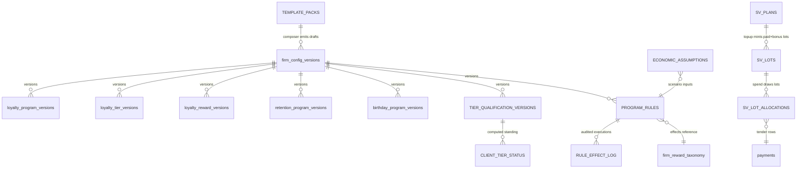
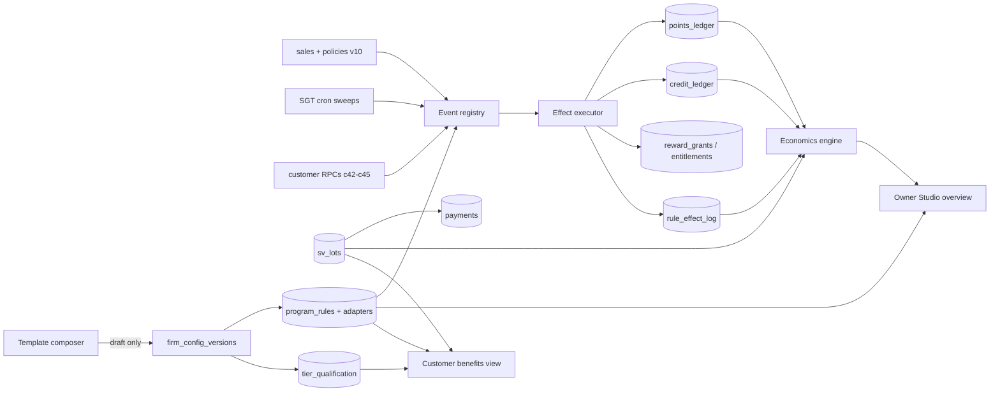

# Frenly Program Studio — architecture proposal

Status: **PROPOSAL — awaiting owner review. No implementation until approved.**
Author: Fable 5 (reviewer/orchestrator). Date: 2026-07-23.
Supersedes: the four-feature v54 plan (templates / top-ups / overview / economics as
separate builds) and design-queue items that overlap.

CHAGEE screenshots are used ONLY as an experience reference (tier progress, grouped
benefits, birthday gifts, recurring perks). No branding, artwork, tier names, or copy
is reproduced.

---

## 0. The central claim, proven up front

The brief demands: *all programmes share one configurable engine and one source of
truth.* The design meets this with four singletons — three of which already exist in
production and are battle-tested:

| Singleton | What it is | Status |
|---|---|---|
| **One config spine** | `firm_config_versions` — every program's configuration is a typed row-set keyed by `config_version_id`, edited only in drafts, published atomically, immutable after publish, hash-snapshotted. Loyalty, tiers, rewards, branch overrides, retention, and birthday ALREADY version here. | LIVE (v26–c45) |
| **One value substrate** | All customer value moves through exactly two guarded append-only ledgers (`points_ledger`, `credit_ledger`) plus typed entitlement rows (`reward_grants`, `customer_birthday_entitlements`), every write scope-guarded, idempotent, reversal-aware, stamped with `config_version_id`. | LIVE (v20–v50) |
| **One event dispatcher** | Today implicit: `app.on_sale_recorded` (earn → tier multiplier → retention → referral, in one ordered body) + cron sweeps + customer-action RPCs. The Studio **formalizes** this into a declared event registry and routes every new mechanic through it. | FORMALIZED by PS-1 |
| **One projection layer** | Owner overview, customer benefits view, and the economics engine all READ the real config and real ledgers. Nothing is copied; adapters are SQL views, not tables. | NEW (PS-1, PS-4) |

**The design rule that keeps one source of truth forever:** configuration lives once
(in version-scoped tables under the spine), value lives once (in the ledgers),
everything else — overviews, rule listings, economics — is a projection. Any feature
that would require copying config or value into a second store is rejected at review.

**The honest trade-off, stated plainly:** the existing mechanics (points earn,
retention, referral, birthday) keep their specialized versioned tables as their rule
representation. They are *expressed* in the generic rule shape through read-only
adapter views, and *new* mechanics are born as generic `program_rules` rows. A
big-bang rewrite of five proven engines into one physical rules table would maximize
regression risk against the most-tested code in the product for zero behavioral gain;
instead the generic rule shape is the **contract**, adopted now for everything new,
with a defined convergence path (§12) for later physical migration if ever warranted.
One engine ≠ one table; it means one spine, one substrate, one dispatcher, one
projection — which this design delivers.

---

## 1. Capability vs gap matrix

| # | Component | Engine today | Config home | Gap to Studio target |
|---|---|---|---|---|
| 1 | Points | `loyalty_programs` models `classic`/`points_tiers`; earn knob, FEFO batches, 3 expiry modes | spine ✅ | none (adapter view only) |
| 2 | Stamps | `loyalty_model='stamps'`, `stamp_per_cents`, milestones via rewards | spine ✅ | none (adapter view only) |
| 3 | Tiers | `loyalty_tiers` threshold/multiplier/perk on visits/spend/points basis | spine ✅ | **qualification ≠ balance not enforced; no periods (lifetime only); no entry rewards; no customer-facing progress** → PS-3 |
| 4 | Rewards | `loyalty_reward_versions` rich catalog (v27) + taxonomy (v28) | spine ✅ | est. cost exists (`estimated_cost_cents`) but unused by any economics → PS-4 |
| 5 | Birthday / occasions | c45: window, entitlement, redeem/reverse, PDPA-safe | spine ✅ | birthday-only; generalize to occasions (anniversary, festivals) via rules → PS-1 |
| 6 | Member's Day / recurring perks | — | — | **missing entirely** → PS-1 (the flagship new mechanic) |
| 7 | Top-up / stored value | — (credit ledger + credit tender exist as substrate) | — | **missing entirely** → PS-2 |
| 8 | Referrals | v3/v20: one-sided, qualify-on-visit, credit payout | ⚠️ NOT on spine (`referral_programs` is unversioned) | adopt into spine + rule adapter → PS-1; two-sided upgrade later |
| 9 | Retention / win-back | v37b versioned rules + v50 campaigns/holdouts/lift | spine ✅ | none (adapter view only) |
| 10 | Packages | v6/v10/v34 sell, consume, idempotent (v51a) | ⚠️ plans unversioned | overview projection; versioning optional (plans are inventory-like, not rules) |
| 11 | Memberships | v5 plans, enroll, renewal cron, idempotent (v51a) | ⚠️ plans unversioned | same as packages |
| — | Economics | credit + gift-card liability lines only | — | **missing**: points liability, realized cost, %, scenarios, budgets → PS-4 |
| — | Templates | industry presets = module lists only | — | **missing**: pack/overlay/composer → PS-5 |
| — | Overviews | none (per-module pages only) | — | **missing** → UI waves |

---

## 2. Canonical entities and relationships

New entities in **bold**; all new tables follow house invariants (§11).



- **`program_rules`** — the generic rule (§3), version-scoped (`config_version_id`),
  immutable once its version publishes. Carries composer explanations inline.
- **`rule_effect_log`** — append-only execution audit: rule_id, event, client,
  effect outcome (`applied` / `suppressed:<reason>` / `budget_exhausted`), cost_cents,
  idempotency key. The budget-cap counter and the economics realized-cost source.
- **`sv_plans` / `sv_lots` / `sv_lot_allocations` / `sv_operations`** — stored value (§4).
- **`tier_qualification_versions` / `client_tier_status`** — tiering (§5).
- **`template_packs` / `market_overlays`** — data-only industry packs + country overlays (§7, §9).
- **`economic_assumptions`** — per-business, per-component redemption-rate and margin
  assumptions with low/base/high bands (§6).
- **Adapter views** — `v_program_rules_all`: `program_rules` UNION read-only
  projections of loyalty/retention/birthday/referral config expressed in the rule
  shape, tagged `source_engine`. Views only — zero copied rows.

---

## 3. The rule model — WHEN / IF / THEN / WITH / DURING / USING

One row of `program_rules`:

| Clause | Column(s) | Typed content |
|---|---|---|
| WHEN | `event_type` | From the **event registry**: `sale.recorded`, `checkout.evaluating`, `topup.purchased`, `tier.promoted`, `tier.renewed`, `occasion.window_open` (birthday generalized: anniversary-of-first-visit, owner-defined dates), `schedule.window` (Member's Day), `referral.qualified`, `campaign.return_recorded`, `membership.renewed`, `package.session_used`, `feedback.submitted`. Registry is a CHECK-constrained vocabulary; adding an event is a migration, never free text. |
| IF | `conditions` jsonb, schema-validated per event | tier in […], min bill, kinds/items in […], client segment (lapsed N days / min visits — C360 vocabulary), branch in […], first-visit, has-membership, consent present. Conjunctive list; each condition is `{field, op, value}` from a typed catalog. |
| THEN | `effects` jsonb | Typed effects, all fulfilled through the existing substrate: `grant_reward{taxonomy_id, params}` (→ `reward_grants`), `grant_entitlement{…}` (→ c45-pattern entitlement), `credit{cents}` (→ `credit_ledger`), `points_bonus{multiplier|flat}` (→ earn pipeline), `discount{pct|cents, scope}` (checkout-applied, §3a), `display_perk{label}` (advertised only — no value movement, honest by construction). |
| WITH | `limits` jsonb + `monthly_budget_cents` | per-customer per-period caps (1/day, 1/window, N/lifetime), audience cap, and a hard monthly budget enforced by the executor (v50 budget-cap precedent): when `rule_effect_log` month-to-date cost + candidate cost > budget → outcome `budget_exhausted`, effect refused, owner alerted in overview. |
| DURING | `schedule` jsonb | SGT-anchored: date range, weekly (days-of-week), monthly (e.g. 15th = Member's Day), time windows. Evaluated with the v52 SGT date discipline. |
| USING | `stack_group`, `priority`, `stack_mode` | §3a. |

**3a. Stacking and the enforcement point.** A new read-only RPC
`evaluate_checkout(business, client, cart_lines?)` is the single place stacking is
resolved: it loads applicable rules (event `checkout.evaluating` + schedule + IF),
groups by `stack_group` (e.g. `bill_discount`, `item_discount`, `earn_bonus`),
applies `stack_mode` (`exclusive`: highest `priority` wins; `stack`: combine, subject
to a per-business global cap `max_total_discount_pct`), and returns BOTH the applied
set and the suppressed set with reasons — explainability at runtime, not just at
setup. Phase A: results render as staff-honored perk hints at the till and in the
wallet ("today: 15% off total bill"). Phase B: `record_cart_sale` accepts the
evaluation token and applies `discount` effects as real negative adjustments —
requires a signed-discount line type (schema change flagged in PS-1) so financial
truth stays in `sale_items`, never in UI arithmetic.

**3b. Adapter views.** Existing engines project into the same shape (read-only):
points earn = `WHEN sale.recorded IF earns_points THEN points(rate × tier multiplier)`;
retention rule = `WHEN sale.recorded IF visits≥goal in window THEN grant_reward`;
birthday = `WHEN occasion.window_open(birthday) THEN grant_entitlement`; referral =
`WHEN sale.recorded IF referred ∧ pending ∧ min_spend THEN credit(referrer)`. The
overview and economics consume `v_program_rules_all` and cannot tell native rows from
adapters — uniform treatment without duplication.

---

## 4. Top-up / stored value ledger design

**Hard requirement honored: paid and bonus value are never one indistinguishable
balance.**

- **`sv_plans`** — the ladder: `business_id, pay_cents, bonus_cents, active, sort`,
  version-scoped display copy; effective-discount check ≤ a sanity cap (default 30%,
  overlay-configurable) so a fat-fingered $500→$899 requires an explicit override.
- **`sv_lots`** — one top-up mints **two lots**: `{lot_class:'paid', amount, remaining}`
  and `{lot_class:'bonus', …}`, each with independent `expires_at` (defaults: paid
  never expires; bonus 12 months — overlay-tunable), `refundable` (paid true, bonus
  false), `source_operation_id`. Append-only; remaining mutated only by the guarded
  spend/reverse ops (points_batches FEFO precedent).
- **Spend** — new op `record_sv_tender` mirroring `record_credit_tender` exactly:
  keyed op ledger (`sv_operations`, v51a pattern), reserve→complete, posts one
  `payments` row (method **`stored_value`** — one CHECK extension to v20's method
  list) and **`sv_lot_allocations`** rows recording exactly which lots funded the
  payment (lot_id, amount). **Spend order: bonus first, FEFO within class** — burns
  pure-cost liability first and leaves the refundable paid remainder, which is the
  customer-fair refund posture.
- **Reversal** — reversing a sale paid by SV restores the exact allocated lots
  (allocation rows make this deterministic); expired-lot restoration re-opens the lot
  with its original expiry (documented; a reversal never mints fresh bonus).
- **Refund / cash-out** — paid-lot remainder refundable via an owner-gated op
  (reversal-provenance style, audit-logged); bonus lots never cash out; both rules
  CHECK-enforced, not UI-enforced.
- **Eligibility / stacking** — buying a top-up is `sales.kind='topup'` with v10
  policy defaults `revenue=false, visit=false, points=false` (v9 gift-card
  precedent: cash collected ≠ revenue; revenue recognizes when SV is spent on a real
  sale). Whether SV-funded sales earn points is a policy flag (default true — it is a
  real visit). Top-up purchase itself never triggers earn/retention/referral.
- **Liability** — `Σ remaining` split by lot_class: `sv_paid_liability` (deferred
  revenue) vs `sv_bonus_liability` (promotional expense) — separately reported (§6)
  and separately classified for accounting export (§10).
- ⚖️ Single-merchant limited-purpose stored value is generally excluded from SG
  Payment Services Act SVF licensing; expiry/refund T&Cs need counsel review before
  live money. Flagged for the launch gates; no compliance claim made.

## 5. Tier qualification design

**Hard requirement honored: qualification is computed from qualifying activity,
never reduced by spending points.**

- **`tier_qualification_versions`** (version-scoped): `basis`
  (`spend` | `visits` | `qualifying_points`), `period_type`
  (`lifetime` | `calendar_year` | `rolling_days` | `anniversary`), `rolling_days`,
  `renewal_grace_days`. `loyalty_tier_versions` extends with `qualify_threshold`
  (decoupled from the legacy display `threshold`), `entry_reward_taxonomy_id`
  (granted once per promotion via a system rule `WHEN tier.promoted`), and
  `display_perks` jsonb (advertised-only).
- **`client_tier_status`** — computed standing, not source of truth: `client_id,
  tier_id, achieved_at, valid_until, progress_current, progress_target,
  qualifying_period_start/end`. Recomputed on qualifying events (cheap incremental)
  + nightly SGT sweep for expiries/renewals (emits `tier.renewed` / demotion).
  Progress powers the customer card ("4 visits to Gold — valid through Jan 2027").
- Qualifying counters derive purely from ledgers: spend = non-reversed
  `counts_as_revenue` sales in period; visits = `counts_as_visit` net of reversals;
  qualifying_points = Σ `points_ledger` `earn` entries in period (redeem rows are
  ignored by construction — the separation is structural, not procedural).
- Multiplier semantics unchanged (v23g); demotion policy (`hold_until_period_end`,
  default) explicit in config.

## 6. Economics engine — formulas

All read-model; zero new value stores. Per rule/component and rolled up:

```
reward_variable_cost   = credit: credit_cents
                         free_item: item_price × (1 − margin_band)   [confidence: margin source]
                         discount: eligible_bill_estimate × pct
expected_cost          = eligible_events × trigger_rate × redemption_rate × reward_variable_cost
                         (rates from economic_assumptions: low / base / high)
realized_cost (period) = Σ rule_effect_log.cost + Σ redemptions credit + Σ grants fulfilled
                         + sv_bonus consumed + birthday/campaign costs (v50 already tracks)
cost_pct_of_revenue    = realized_cost / period revenue (v10 counts_as_revenue, reversal-aware)
liabilities            = points: Σ batch remaining × point_value
                           where point_value = min(credit_cents/cost_points) over active
                           catalog (classic: reward_credit_cents/redeem_points)
                         credit: Σ client_credit_balance   (exists)
                         gift cards: Σ active balances     (exists)
                         SV: Σ paid remaining ∥ Σ bonus remaining (separate lines)
effective_topup_disc   = bonus / (paid + bonus)
break_even_uplift      = expected_cost / gross_margin_fraction
budget_guard           = month-to-date realized ≥ monthly_budget_cents ⇒ executor refuses
```

Margin inputs: optional `margin_band` on services/products categories (Conservative
defaults per industry pack when absent — flagged low-confidence). Every composer
estimate carries `{value, basis, confidence, inputs_used[]}`.

## 7. Template-generation logic (the composer)

`generate_program_draft(business, pack, objective, posture)` — SECURITY DEFINER,
owner-only, **emits exactly one `firm_config_versions` draft** (existing machinery:
clone-from-active, snapshot hash, one-published-per-business invariant). Never
publishes; publish stays the owner's explicit reviewed action. Pipeline:

1. **Read real data**: services/products (price bands, categories), popularity
   (sale_items ≥ v51 + sales history), capacity signals (stock, branch counts),
   existing config (never overwrite non-default settings without flagging).
2. **Select pack** (industry) × **objective** (frequency / average-bill / win-back /
   prepaid-cashflow) × **posture** (Conservative/Balanced/Growth = cost multipliers,
   e.g. reward budget 3% / 5% / 8% of trailing revenue).
3. **Compose components**: earn model + rate; reward catalog *from the merchant's own
   items* (free cheapest-popular item, mid-band % off, credit rungs); 3–4 tiers with
   escalating benefits; birthday set; Member's Day rule; SV ladder within the
   effective-discount cap; referral reward sized to CAC proxy.
4. **Attach explanations to every generated row**: why chosen, which data used
   (named inputs), estimated customer value + business cost (with confidence),
   scenario table. Stored on the draft rows — the review UI renders them verbatim.
5. Owner reviews one preview screen (all components + total economics) → edits →
   Publish (existing atomic publish). Target: first program live < 3 minutes.

## 8. Wireflow (both surfaces)

**Owner — Program Studio** (replaces the Grow group's separate pages progressively):
`Studio home` = one card per enabled component (status chip, audience, schedule,
month cost vs budget, liability share, performance sparkline) + total economics
header + "Set up with a template" CTA →
`component detail` = rules list (native + adapter, uniformly) → rule editor
(WHEN/IF/THEN/WITH/DURING/USING as guided plain-language steps) → draft preview with
economics deltas → Publish / Pause (pause = rule `active=false` via draft→publish;
emergency pause = immediate with audit).

**Customer — Benefits overview** (wallet, per business; only enabled sections
render): tier progress card (name, progress bar, "N to next", valid-through) →
available rewards (unlocked vs locked-at-next-tier) → birthday/occasion gifts →
recurring perks ("every 15th: …") → stored value (paid + bonus shown distinctly,
expiries) → packages/memberships → referral share. Anti-gating and PDPA copy rules
apply throughout.

## 9. Core engine / industry packs / market overlays

Strict layering, **data not forks**: core engine = schema + dispatcher + executor +
economics (no industry strings); `template_packs` = data (component presets,
posture multipliers, naming vocabulary per industry: F&B, salon, spa, fitness,
retail); `market_overlays` = data (currency, timezone, tender labels, consent copy,
tax classification map, legal-note templates, sanity caps). Resolution:
core ← pack ← overlay ← firm's own edits — later layers override, provenance kept.

## 10. Singapore overlay (first market)

SGD minor-units everywhere (existing); Asia/Singapore anchoring (v52 discipline —
all DURING schedules evaluate in SGT); PayNow tender labels (exists in v20 methods);
PDPA: marketing-perk rules carry a `requires_consent` condition wired to the
existing `consents` table, withdrawal honored at evaluation time, purpose strings in
the overlay copy; EN/ZH-ready: all customer-facing copy fields are `{en, zh}` jsonb
with EN fallback (no hardcoded strings in effects); accounting classifications
(configurable + reviewable, ⚖️ no compliance claims): SV paid = deferred revenue,
SV bonus = promotional expense on consumption, points liability = provision,
gift cards = existing v9 treatment; classification map lives in the overlay and is
exported with reports.

## 11. Security, idempotency, reversal, historical-snapshot requirements

Every new table: RLS + owner-read + `sa_read`, `revoke all` + explicit grants,
tenant-safe composite FKs, append-only guards where value moves (v34/v50 style).
Every value-moving RPC: SECURITY DEFINER, pinned search_path, authenticated-only,
keyed idempotency (op-ledger pattern), advisory locks on hot keys. Rules immutable
once their config version publishes (spine guarantee); `rule_effect_log` and
`sv_lot_allocations` stamp `config_version_id` + `rule_id` so any historical effect
is reproducible against the exact config that produced it. Reversals: SV lot
restoration via allocations; entitlement reversal per c45; grant reversal via
existing provenance; no effect is ever silently deleted. Anti-review-gating and
PDPA invariants carried forward. Composer and Studio never silently publish —
enforced by the spine (only `publish_loyalty_config` flips a version live).

## 12. Convergence path (avoiding a frozen hybrid)

PS-1 adopts the rule contract for everything new. Each later major MAY physically
migrate one specialized engine into `program_rules` (starting with referral — the
simplest and the only one off-spine today) with byte-equivalent behavior proven by
the rehearsal matrix before cutover. The adapter views make this invisible to every
consumer. No deadline pressure: the projections keep the product uniform meanwhile.

## 13. Migration sequence + revised build order

| Phase | Migration(s) | Contents | Key acceptance tests (each = rolled-back suite + matrix) |
|---|---|---|---|
| **PS-1** | v54 | Event registry; `program_rules` + effect executor + `rule_effect_log`; adapter views; `evaluate_checkout` (read-only); occasion generalization; Member's Day via entitlements; referral config adopted onto spine | rule fires once per event (idempotent); schedule honored across SGT midnight; stacking: exclusive beats stack, cap holds, suppression reasons returned; budget cap refuses at limit; adapters byte-match native behavior for a fixture config; draft/publish immutability holds for rules |
| **PS-2** | v55 | `sv_plans/lots/allocations/operations`; `topup` sale kind + policies; `stored_value` payment method; sell/spend/reverse/refund ops; liability views | paid/bonus never merge (structural); bonus-first FEFO spend; reversal restores exact lots; refund pays paid-remainder only; bonus cash-out impossible; effective-discount cap enforced; liability splits reconcile to lots; idempotent replays across all ops |
| **PS-3** | v56 | `tier_qualification_versions`; `client_tier_status`; `tier.promoted/renewed` events; entry rewards via system rules; nightly SGT sweep | redeem never reduces qualification; each period_type boundary correct at SGT midnight; promotion grants entry reward exactly once; demotion policy honored; progress math matches ledger recomputation |
| **PS-4** | v57 | `economic_assumptions`; margin bands; `get_program_economics`; budget-cap wiring into executor; points-liability line | formula outputs match hand-computed fixtures incl. scenarios; liability lines reconcile to ledgers; low-confidence flagged when margin absent; budget refusal logged and surfaced |
| **PS-5** | v58 | `template_packs` + `market_overlays` (SG) + `generate_program_draft` | composer emits ONE draft, never publishes; every generated row carries explanation+inputs+cost+confidence; regeneration is idempotent per (pack, posture, catalog hash); non-default firm settings never overwritten silently |
| **UI-A** | after PS-1 | Studio home (owner overview) + rule editor + pause | all six states; adapter/native uniformity; a11y |
| **UI-B** | after PS-2 | Till/cart top-up sell + SV tender + wallet SV card (paid/bonus distinct) | double-tap safe; honest partials |
| **UI-C** | after PS-3 | Customer benefits overview + tier progress card | sections render only when enabled; anti-gating |
| **UI-D** | after PS-5 | Composer wizard with economics preview | draft-only; sub-3-minute setup on a fixture tenant |

Sequencing rationale: PS-1 first because rules/events are the contract everything
else writes to; SV second (owner's most-requested revenue feature, independent of
tiers); tiers third (customer-visible wow); economics fourth (needs effect log + SV
data to be meaningful); composer last (composes all prior layers). Every phase ships
through the existing loop: rehearsal chain replay, full suite matrix, production
apply only after green, UI call-site audits.

## 14. Module interconnection map


