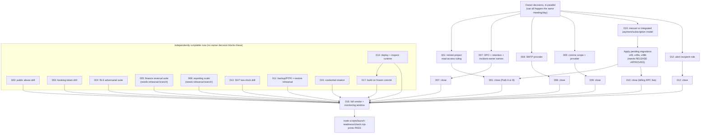

# Launch evidence plan — index

Source of truth for status: `docs/launch/launch-blockers.json` (17 P0, all `BLOCKED` as of this pack).
This index does not change that file or any gate status — it is the routing table for the 17
per-blocker recipes in this directory, so each named owner can close their gate in the shortest real
path. See each `P0-*.md` file for the full procedure, preconditions, and evidence-capture recipe.

Every evidence artifact goes to `docs/launch/.evidence/<run-id>/<blocker-id>.json` (gitignored),
matching the exact shape enforced by `scripts/launch-readiness/check.mjs` and documented in
`docs/launch/POST_CLAUDE_RUNBOOK.md`. Pick one `run-id` per rehearsal/production pass (for example
`RUN_ID="sg-launch-$(date -u +%Y%m%dT%H%M%SZ)"`, the same convention `SYNC_RUN_ID` uses in
`docs/supabase-sync/CLI_RUNBOOK.md`) and use it for every artifact captured in that pass. After hashing
an artifact with `shasum -a 256 <file>`, add `{ "path": ..., "sha256": ... }` to that blocker's
`evidence` array in `launch-blockers.json` and move its `status` to `VERIFIED_PRODUCTION` — that edit is
the release owner's, not this agent's or this plan's.

## 1. All 17, at a glance

| # | Blocker | Owner (per manifest) | Classification | Est. time |
|---|---|---|---|---|
| 1 | P0-CUTOVER-PARITY-001 | Release engineering | OWNER-ACTION-SCRIPTED (+ 1 owner decision) | 45min–4h |
| 2 | P0-PUBLIC-ABUSE-002 | Application security | OWNER-ACTION-SCRIPTED | 45–90 min |
| 3 | P0-BOOKING-TOKEN-003 | Application security | OWNER-ACTION-SCRIPTED | 45–75 min |
| 4 | P0-RLS-GRANTS-004 | Database security | OWNER-ACTION-SCRIPTED | 60–90 min |
| 5 | P0-FINANCE-REVERSAL-005 | Financial systems | OWNER-ACTION-SCRIPTED | 1.5–3 h |
| 6 | P0-REPORTING-SCALE-006 | Data engineering | ENGINEERING-PREP-COMPLETE / OWNER-ACTION-SCRIPTED | 2–3 h |
| 7 | P0-PDPA-OPERATIONS-007 | Privacy operations | OWNER-DECISION / OWNER-ACTION-SCRIPTED | 30–60 min decide, 60–90 min rehearse |
| 8 | P0-AUTH-EMAIL-008 | Identity engineering | OWNER-ACTION-SCRIPTED (+ 1 owner decision: SMTP provider) | variable decide, 60–90 min execute |
| 9 | P0-NOTIFICATIONS-009 | Product operations | OWNER-DECISION / OWNER-ACTION-SCRIPTED | 30–60 min decide, 2–4 h execute |
| 10 | P0-PAYMENTS-SUBSCRIPTIONS-010 | Commercial systems | OWNER-DECISION / OWNER-ACTION-SCRIPTED | 15–30 min decide, 30–45 min execute (manual path) |
| 11 | P0-BACKUP-ROLLBACK-011 | Platform operations | OWNER-ACTION-SCRIPTED | 45–90 min |
| 12 | P0-OBSERVABILITY-012 | Platform operations | OWNER-ACTION-SCRIPTED (+ 1 owner decision: alert role) | 60–90 min |
| 13 | P0-SGT-TIMEZONE-013 | Application engineering | ENGINEERING-PREP-COMPLETE / OWNER-ACTION-SCRIPTED | 60–90 min |
| 14 | P0-TARGET-RUNTIME-014 | Release engineering | ENGINEERING-PREP-COMPLETE | 20–30 min |
| 15 | P0-TEST-CREDENTIALS-015 | Security operations | OWNER-ACTION-SCRIPTED | 45–75 min |
| 16 | P0-POST-CUTOVER-SMOKE-016 | Release engineering | OWNER-ACTION-SCRIPTED (last gate) | 1–2 h + monitoring window |
| 17 | P0-RELEASE-BUILD-017 | Release engineering | ENGINEERING-PREP-COMPLETE | 20–30 min |

**Classification counts:** 4 ENGINEERING-PREP-COMPLETE (006\*, 013\*, 014, 017 — \*=partial/hybrid),
5 with an explicit OWNER-DECISION precondition (001, 007, 008, 009, 010, 012 — six, see note), 12
OWNER-ACTION-SCRIPTED as the terminal step for every one of the 17. None of the 17 are pure
OWNER-DECISION with no scripted component — every gate ends in something a human runs and captures.

## 2. Critical path — what has to happen, in what order

The real bottleneck is not scripting effort (most of the mechanical tooling already exists and passes
locally — see the "Verified today" notes in each plan) but **owner decisions and one migration apply**.
Sequence:

**Reading it:** six owner decisions can all be made in one sitting and unblock the rest of the plan.
Applying the three pending migrations (v49/v49a/v49b) needs `RELEASE APPROVED` and directly gates both
`001` and `010`. Everything else in the middle block (002-006, 011, 013-015, 017) needs no owner
decision at all and can be scripted and captured in parallel by the named owners in
`launch-blockers.json` today. `016` is always last, by the manifest's own design.

**Realistic total wall-clock, assuming decisions happen promptly and work is parallelized across the
named owners:** roughly 1-2 business days of actual effort, dominated by (a) getting `RELEASE APPROVED`
and applying the 3 pending migrations, (b) provisioning an isolated rehearsal branch for the two
concurrency-harness gates (005, 006), and (c) the `P0-POST-CUTOVER-SMOKE-016` monitoring window, which
is calendar time, not effort time, and the owner should set its length explicitly (a 24-72 hour window is
typical for this kind of cutover).

## 3. Discrepancies found while building this plan (report these back, do not silently fix)

- **`supabase/canonical-migration-order.manifest.json` and `.plan.json` show `pendingCount: 33`, but a
  live read-only `list_migrations` against `gadpooereceldfpfxsod` today shows only 3 migrations
  actually missing** (`v49`, `v49a`, `v49b`). The 45/33 split is a hardcoded historical constant in
  `scripts/migrations/materialize-canonical-order.mjs` (lines 323-324) describing the catalog-recovery
  boundary, not a live count. Anyone reading that manifest at face value would badly overestimate how
  much migration work is left. See `P0-CUTOVER-PARITY-001.md`.
- **The Billing fix the production readiness review calls for (`v_business_billing` /
  `app.billable_seats`) ships in `v49`, which is one of the three migrations not yet applied to
  production.** Do not evidence a Billing-page fix under `P0-PAYMENTS-SUBSCRIPTIONS-010` until `v49` is
  confirmed live.
- **`docs/launch/ROLLBACK_RUNBOOK.md` still frames DB migration rollback in terms of "v18 → v21"** even
  though the canonical chain now runs through v49b (78 migrations). The no-split-brain rule and Edge
  Function rollback commands in that file are still accurate; only the migration-range framing is stale.
  See `P0-BACKUP-ROLLBACK-011.md`.
- **`docs/launch/ROLLBACK_RUNBOOK.md` points to `functions/README.md`; the file actually lives at
  `supabase/functions/README.md`.** Minor path error, not a missing file.
- **CLAUDE.md records an explicit open question — "Email campaigns are a separate capability the comms
  deferral arguably doesn't cover — unresolved"** — this blocks a clean scope statement for
  `P0-NOTIFICATIONS-009` until the owner answers it.
- **The "Week-view uses browser-local time" residual** recorded in `CLAUDE.md` and the 2026-07-21 v41
  audit (UX-004) **appears closed on inspection of the current `app/index.html`** (post-v48): `weekStart()`
  and `eventParts()` now do explicit `+8h`/UTC-getter arithmetic with no browser-local `Date` read. This
  is a source-level finding, not yet a runtime-proven one — see `P0-SGT-TIMEZONE-013.md` for the drill
  that would confirm it.
- **Every script and test file referenced across all 17 plans in this pack was confirmed to exist** by
  reading it or executing it during this review (`npm run validate`: 393/393 tests, fully offline, plus
  targeted re-runs of `tests/public-gateway`, `tests/security-hardening`, `tests/pdpa-pages`,
  `scripts/reporting-scale`). No dangling script reference was found this pass.
